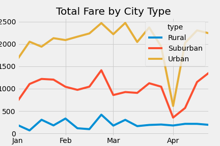

# PyBer Analysis
## Overview
### Purpose 
The purpose of this analysis is to show the different city types of PyBer Riding and the ride-sharing data, more specifically the fares by each city, total drivers by each city, and total rides by city. We are doing this analysis to show which city types are creating the most revenues to make decisions in the future, regarding the company. 
## Results
The results of these analyses is to show last years data and how the city types compare in analyses: total drivers, total rides, the average fare per ride and driver, and the total fares per city type . In all of the results, Urban city type has the overall largest percentages in all the analyses. 
###### Total Rides

The total rides per city type is shown above. The city type Urban has more the two-thirds of the riders in the entire data. This is no surprise due to the fact that people in urban areas tend to use ride-sharing services to get from one destination to another for reasons like travel. 

###### Total Drivers

The total drivers per city type is shown above. Again, the Urban city type has the majority of drivers. Since most of the rides happen in Urban areas, it makes sense to have majority of the drivers in the Urban areas. The percentages are lower in the total rides for the Suburban and Rural areas, therefore have less drivers. 

###### Total Fares by City Type

The total fares by city type can be shown above. The use of a line chart can show the fluctuations over time of the different city types and total fares. As shown, the best time for ride-sharing is at the end of Feburary and the worst time is in the month of April.  

###### Average Fare per Ride and Driver
###### Note: Circle size correlates with driver count per city.

The average fare per ride and driver are as expected, with Urban city type creating the most fares and total rides. 
## Summary
In summary, I believe we need to concentrate for future business decisions on Urban city types. The majority of riders, drivers, and revenue come from Urban cities, so focusing our efforts on these cities can increase profits. We can also focus to try and grow the Rural and Suburban city types; more advertisement and discount codes can help increase rides in these city types.
